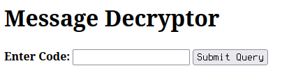
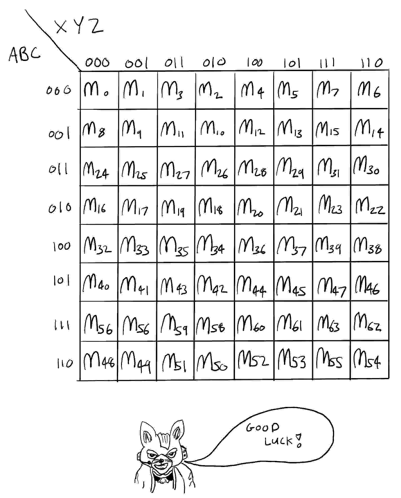

# Opensesame (1 of 2)

## Solution

We are given a zip file containing an html page and two js files, if we open the page we are presented with



this basically validates a code we put inside and tells us if it's correct.

Opening the html file and inspecting it we can see that the code we input is checked and if it is correct it decrypts an image.

After a bit of beautifying and renaming we get these functions

```js
function first_check(inputstr) {
    if (typeof inputstr != 'string') return ![];
    if (inputstr['length'] != 0x22) return ![];
    return q1 = reverseinput(inputstr), q1 = x3(q1), q2 = x4(q1), x5(q2);
}
```

I removed the debugger statements in order to debug the script without hassle, after the length check the string is reversed (noticed by breaking at that function return), then 3 checks are made.

```js
function x3(arg) {
    var localin = somefun;
    a = [], ss = [
        [0x10, 0x18],
        [0x1f, 0x13],
        [0xf, 0x17],
        [0x1e, 0x12],
        [0x9, 0x14],
        [0x1c, 0x1d],
        [0x16, 0x1a],
        [0x11, 0x21],
        [0x15, 0x19],
        [0xd, 0x7],
        [0xb, 0x1],
        [0x4, 0x0],
        [0xc, 0x20],
        [0x6, 0x2],
        [0x3, 0x1b],
        [0x8, 0xe],
        [0x5, 0xa]
    ];
    for (i = 0x0; i < ss[localin(0x1e8)]; i++) {
        s = ss[i], a[s[0x0]] = arg[s[0x1]], a[s[0x1]] = arg[s[0x0]];
    }
    return a['join']('');
}
```

`x3` basically swaps the characters positions by using `ss` as the array of positions, `x4` we can notice by debugging that converts the characters to integers.
`x5` is the last check and this is the most important one, it performs some computation on the values of the characters and compares them to some values, this is basically a job for [z3](https://github.com/Z3Prover/z3), a popular theorem prover, here is the script that solves the challenge.

```py
from z3 import BitVec, Solver, And
i = [BitVec('i_'+str(x), 8) for x in range(0x22)]
s = Solver()
scrambled = [ None for x in range(0x22)]
subs = [[0x10,0x18],[0x1f,0x13],[0xf,0x17],[0x1e,0x12],[0x9,0x14],[0x1c,0x1d],[0x16,0x1a],[0x11,0x21],[0x15,0x19],[0xd,0x7],[0xb,0x1],[0x4,0x0],[0xc,0x20],[0x6,0x2],[0x3,0x1b],[0x8,0xe],[0x5,0xa]]
reversedi = i[::-1]
for x in subs:
    scrambled[x[0]] = reversedi[x[1]]
    scrambled[x[1]] = reversedi[x[0]]
s.add(And(scrambled[0x7] + scrambled[0xf] == 0xa3 , scrambled[0x1f] + scrambled[0xd] == 0xac , scrambled[0x17] + scrambled[0x20] == 0xa9 , scrambled[0x14] + scrambled[0x11] == 0x97 , scrambled[0x1b] + scrambled[0xe] == 0x93 , scrambled[0x12] == 0x67 , scrambled[0x19] - scrambled[0xc] == -0xd , scrambled[0xb] * scrambled[0xa] == 0xaf5 , scrambled[0x5] - scrambled[0x1a] == -0x9 , scrambled[0x1e] * scrambled[0x9] == 0x1f44 , scrambled[0x3] * scrambled[0x0] == 0x2698 , scrambled[0x1d] + scrambled[0x16] == 0xa7 , scrambled[0x18] - scrambled[0x4] == -0x48 , scrambled[0x10] + scrambled[0x1] == 0xcb , scrambled[0x8] == 0x31 , scrambled[0x1c] - scrambled[0x2] == 0x4a , scrambled[0x15] * scrambled[0x6] == 0x2b6b , scrambled[0x13] + scrambled[0x21] == 0xc0 , scrambled[0x7] - scrambled[0xf] == 0x3d , scrambled[0x1f] + scrambled[0xd] == 0xac , scrambled[0x17] - scrambled[0x20] == 0x3b , scrambled[0x14] + scrambled[0x11] == 0x97 , scrambled[0x1b] - scrambled[0xe] == 0xb , scrambled[0x12] * scrambled[0x19] == 0x2639 , scrambled[0xc] - scrambled[0xb] == 0x35 , scrambled[0xa] - scrambled[0x5] == -0x38 , scrambled[0x1a] + scrambled[0x1e] == 0xb9 , scrambled[0x9] - scrambled[0x3] == 0xc , scrambled[0x0] - scrambled[0x1d] == -0x18 , scrambled[0x16] == 0x30 , scrambled[0x18] * scrambled[0x4] == 0x19e1 , scrambled[0x10] == 0x6c , scrambled[0x1] == 0x5f , scrambled[0x8] + scrambled[0x1c] == 0xac , scrambled[0x2] * scrambled[0x15] == 0x122f , scrambled[0x6] * scrambled[0x13] == 0x2c55 , scrambled[0x21] == 0x5f , scrambled[0x7] + scrambled[0xf] == 0xa3 , scrambled[0x1f] == 0x48 , scrambled[0xd] - scrambled[0x17] == -0xe , scrambled[0x20] == 0x37 , scrambled[0x14] * scrambled[0x11] == 0x1386 , scrambled[0x1b] * scrambled[0xe] == 0x14fc , scrambled[0x12] * scrambled[0x19] == 0x2639 , scrambled[0xc] * scrambled[0xb] == 0x1734 , scrambled[0xa] == 0x33 , scrambled[0x5] - scrambled[0x1a] == -0x9 , scrambled[0x1e] * scrambled[0x9] == 0x1f44 , scrambled[0x3] == 0x68 , scrambled[0x0] + scrambled[0x1d] == 0xd6 , scrambled[0x16] == 0x30 , scrambled[0x18] - scrambled[0x4] == -0x48 , scrambled[0x10] + scrambled[0x1] == 0xcb , scrambled[0x8] + scrambled[0x1c] == 0xac , scrambled[0x2] + scrambled[0x15] == 0x90 , scrambled[0x6] == 0x75 , scrambled[0x13] + scrambled[0x21] == 0xc0 , scrambled[0x7] == 0x70 , scrambled[0xf] + scrambled[0x1f] == 0x7b , scrambled[0xd] * scrambled[0x17] == 0x2c88 , scrambled[0x20] * scrambled[0x14] == 0xa87 , scrambled[0x11] + scrambled[0x1b] == 0xb5 , scrambled[0xe] + scrambled[0x12] == 0xab , scrambled[0x19] + scrambled[0xc] == 0xcb , scrambled[0xb] * scrambled[0xa] == 0xaf5 , scrambled[0x5] - scrambled[0x1a] == -0x9 , scrambled[0x1e] - scrambled[0x9] == -0x2f , scrambled[0x3] * scrambled[0x0] == 0x2698 , scrambled[0x4] == 0x7d))
print(s.check())
m = s.model()
password = ""
for x in i:
    password += chr(m[x].as_long())
print(password)
```

There are probably other ways of solving it, and I'm not mad, I didn't manually insert and edit all the constraints inside the script, I used vim macros to do it!

The script returns us the correct code, which is the flag, `flag{wh0_l3t_tHE_5r1p7_k1Dd13_Ou7}`, using it on the web page an image is shown, this is the second part of the challenge.

# Opensesame (1 of 2)

## Solution

Here is the image from the previous part



It is basically a [Karnaugh map](https://en.wikipedia.org/wiki/Karnaugh_map), inspecting the image (the one in the repo is compressed so you won't find it) with an hex editor we can see that at the end of the file, there is a base64 string, decoding it gets us a zip file that has a txt file inside.

```
F = A'BX'YZ + ACX'YZ + AB'C'X'Z + AB'C'XY'Z' + A'B'CXY'Z' + AB'C'X'Y + A'B'CX'YZ'
F = A'BX'YZ + CX'YZ + ABCX'Y + AB'X'YZ
F = BCXY'Z' + AB'C'XY' + AB'CY'Z + BCX'Y + AB'C'X'Y + A'BC'XY'Z
F = AB'CX'Y + BC'XY'Z' + BC'X'Y + AB'C'Y'Z + ACXY'Z + AB'CXY'
F = ABCXY'Z' + A'CX'YZ' + A'BC'X'YZ + AB'X'YZ' + A'B'C'XY'Z'
F = A'B'CY'Z + A'C'X'Y + BCX'Y'Z + ABCXY'Z' + ABCX'Y + AB'XY'Z + A'C'XY'Z'
F = ABCXY'Z' + ABCX'Y + B'X'YZ' + A'B'CX'Y + A'X'YZ'
F = A'BC'X'Y + AB'Y'Z + A'BC'XY'Z' + AB'C'X'YZ' + ACY'Z
F = A'BC'X'Y + AB'CX'Y + AX'Y'Z + BC'X'Y'Z + AB'Y'Z + A'BC'XY'Z' + AB'CXY'
F = A'BX'YZ + CX'YZ + ABCX'Y + AB'X'YZ
F = B'X'Y'Z + A'C'X'Y + A'B'C'XY' + A'C'X'Z + CX'Y'Z
F = ABCXY'Z' + ABCX'Y + B'CX'YZ' + A'BC'X'YZ' + AB'X'YZ'
F = ABC'
F = BC'X'YZ + ABC'X'Y + ABC'XY'Z' + ACXY'Z + A'BC'XY'Z + AB'XY'Z + AB'CXY' + AB'CX'YZ' + AC'X'YZ
F = AB'Y'Z + A'B'XY'Z' + A'B'C'X'Y + ABCXY'Z' + ABCX'Y + A'BY'Z + BCX'YZ' + B'CY'Z + A'BC'X'Z
F = AB'Y'Z + ABCXY' + ABCX'Y + A'BC'Y'Z
F = A'BC'XY' + ACX'Y'Z + A'BC'X'YZ' + AB'C'X'Z + A'BX'Y'Z
F = ABC'
F = ABCXY'Z' + ABCX'Y + B'X'Y'Z + A'X'Y'Z + ABCX'Z
F = AB'Y'Z + A'B'C'X'Y + A'B'C'XY'Z' + ABCXY'Z' + ABCX'Y + A'BY'Z + A'CY'Z
F = AB'Y'Z + B'C'XY'Z' + A'B'C'X'Y + A'BX'Y'Z + ABCXY'Z' + ABCX'Y + A'CX'Y'Z
F = B'X'YZ' + ABCXY'Z' + ABCX'Y + A'X'YZ' + A'B'C'X'Y + A'B'C'XY'Z'
F = A'B'C'X'Y + A'BX'Y'Z + A'B'C'XY'Z' + ABCXY'Z' + ABCX'Y + B'CX'Y'Z + AB'X'Y'Z
F = A'B'C'X'YZ + A'CX'YZ' + AB'X'YZ' + ABCX'YZ + A'BC'XY'Z'
```

this is basically a series of boolean functions, `+` denotes OR, `'` is NOT, and if two letters are near each other that it's an AND, judging by the image it is possible that we have to solve these functions and the output put on a matrix like shown in the Karnaugh map might give us the flag.

```py
from itertools import product as iterproduct
from sympy import *

tknstr = "ABCXYZ"
tokens = {x: symbols(x) for x in tknstr}

funconstraints = []

def parseline(input):
    roba = []
    tmp = []
    tmptk = None
    for tk in input:
        match tk:
            case 'F' | '=':
                pass
            case ' ' | '+' | '\n':
                if tmptk is not None:
                    tmp.append(tmptk)
                    tmptk = None
                if len(tmp) != 0:
                    roba.append(And(*tmp))
                    tmp = []
            case '\'':
                if tmptk is None:
                    raise Exception('Wtf parse error')
                else:
                    tmp.append(Not(tmptk))
                tmptk = None
            case _:
                if tmptk is not None:
                    tmp.append(tmptk)
                tmptk = tokens[tk]

    if tmptk is not None:
        tmp.append(tmptk)
        tmptk = None
    if len(tmp) != 0:
        roba.append(And(*tmp))
        tmp = []
    return Or(*roba)

def assignToSyms(values):
    return {
            tok: val
        for val, tok in zip(values, tokens.values())
    }

valtopos = {0:0, 1:1, 2:3, 3:2, 4:4, 5:5, 7:6, 6:7}
matrix = [[0 for _ in range(8)] for _ in range(8)]

if __name__ == '__main__':
    with open('file.txt', 'r') as f:
        for l in f.readlines():
    for cons in funconstraints:
        for abcxyz in iterproduct([0,1], repeat=6):
            row = abcxyz[0] * 4 + abcxyz[1] * 2 + abcxyz[2]
            col = abcxyz[3] * 4 + abcxyz[4] * 2 + abcxyz[5]
            row = valtopos[row]
            col = valtopos[col]
            result = cons.subs(assignToSyms(abcxyz))
            matrix[row][col] = result

        for x in matrix:
            print("".join(['O' if y else ' ' for y in x]))
```

This script prints the matrices and each one of them draws a character, putting them together gets us the flag `flag{S1mplFi_y0ur_LOGIC}`
