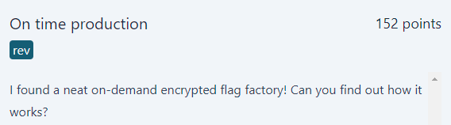

# On time production
<p align="center">
  
</p>

## FLAG:
`GPNCTF{I_gu3ss_s3nd1ng_y0u_th3_k3y_w4sn't_a_g00d_id3a!#b933cf3f}`

## Solution
The challenge provides an [executable](Attachments/client) which communicates with the server and a [zip](Attachments/on-time-production.tar.gz) which contains the client's source code.

```c
#include <fcntl.h>
#include <unistd.h>
#include <stdio.h>
#include <stdlib.h>
#include <string.h>

#include <arpa/inet.h>
#include <stdio.h>
#include <string.h>
#include <sys/socket.h>
#include <unistd.h>

#define PORT 7331

int main()
{
    int socket_fd, status;
    char server_response[512];
    struct sockaddr_in server_addr;

    if ((socket_fd = socket(AF_INET, SOCK_STREAM, 0)) < 0)
    {
        printf("\nError: Could not create socket\n");
        exit(1);
    }

    server_addr.sin_family = AF_INET;
    server_addr.sin_port = htons(PORT);

    if (inet_pton(AF_INET, "46.232.224.167", &server_addr.sin_addr) <= 0)
    {
        printf(
            "\nError: Invalid address/ Address not supported\n");
        exit(1);
    }

    if ((status = connect(socket_fd, (struct sockaddr *)&server_addr,
                          sizeof(server_addr))) < 0)
    {
        printf("\nError: Could not connect to server\n");
        exit(1);
    }

    int response_length = 0;
    int n;
    while ((n = read(socket_fd, &server_response[response_length], 512 - response_length - 1)) > 0)
    {
        response_length += n;
    }
    if (response_length == -1)
    {
        printf("\nError: Error reading from server\n");
        exit(1);
    }
    response_length -= 1; // Remove line break

    if (close(socket_fd) < 0)
    {
        printf("Error: Could not close socket\n");
        exit(1);
    }

    char input[256];
    printf("Please give me the flag: \n");
    int input_length = read(0, input, 255) - 1;

    if (input_length != response_length / 2)
    {
        printf("Wrong length, sorry!\n");
        exit(1);
    }

    char encrypted_input[response_length / 2];
    for (int i = 0; i < input_length; i++)
    {
        encrypted_input[i] = server_response[i] ^ input[i];
    }

    encrypted_input[input_length] = '\0';
    server_response[2 * input_length] = '\0';
    char *encrypted_flag = &server_response[input_length];

    int compare = strcmp(encrypted_input, encrypted_flag);

    if (compare == 0)
    {
        printf("Congrats! Your input is correct. Go and submit it at https://ctf.kitctf.de/challenges\n");
        exit(0);
    }
    else
    {
        printf("Sadly, your input didn't meet the requirements :(.\n");
        exit(1);
    }
}
```

The source code shows how the client handles the response received from the server. In particular, it denotes how this response contains, in the second half, the encrypted flag. Since XOR is commutative, you can obtain the flag by xoring **server_response** and **encrypted_flag**, both contained in the server response. To do this, the following [script](Attachments/solve.py) was created.

```python
from pwn import *

r = remote('on-time-production-0.chals.kitctf.de', 7331)

server_response = r.recv()[:-1]
log.info(f"{server_response = }")

len_flag = len(server_response) // 2
log.info(f"{len_flag = }")

flag = xor(server_response[:len_flag], server_response[len_flag:]).decode()
log.success(f"{flag = }")
r.close()
```