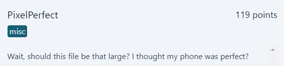
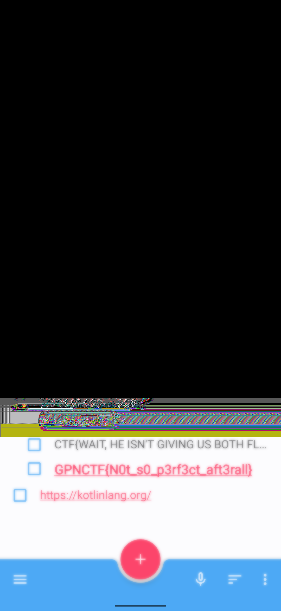

# PixelPerfect
<p align="center">
  
</p>

## FLAG:
`GPNCTF{N0t_s0_p3rf3ct_aft3rall}`

## Solution
The challenge provides a [zip](Attachments/PixelPerfect.tar.gz) containing a screenshot

<p align="center">
  
</p>

and a file whose content is as follows

```
Wait, should this file be that large?
```

Given what was written in the file, I tried to extract information using tools such as *binwalk* and *zsteg*, with no results other than the presence of a corrupt chunk. 

But that information led me nowhere, so I started searching on Google, taking into consideration the title of the screenshot which refers to a Google Pixel 5 and I found an [article](https://www.theverge.com/2023/3/19/23647120/google-pixel-acropalypse-exploit-cropped-screenshots) that talks about a bug in the screenshot editor built into Google Pixels that falls under *CVE-2023-21036*. In particular, this article reports the proof-of-concept [app](https://acropalypse.app/) used to restore the cropped data from the image.

<p align="center">
  
</p>