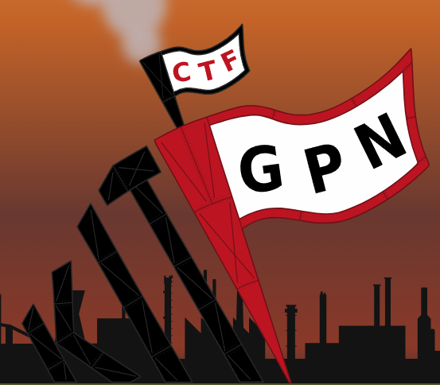

# GPNCTF 2023 - Writeups

  

Writeups of the challenges proposed on [GPNCTF 2023](https://ctf.kitctf.de/).

| **#** | **Category** | **Writeup** | **Points** |
|:---:|:---:|---|:---:|
| 1 | MISC | [insanity-check](insanity-check/README.md) | 100 |
| 2 | CRYPTO | [ref4ctory](ref4ctory/README.md) | 100 |
| 3 | PWN | [Overflow in the fl4gtory](Overflow&#32;in&#32;the&#32;fl4gtory/README.md) | 100 |
| 4 | PWN | [Overlows keep flowing](Overlows&#32;keep&#32;flowing/README.md) | 100 |
| 5 | PWN | [No end in sight](No&#32;end&#32;in&#32;sight/README.md) | 167 |
| 6 | MISC | [PixelPerfect](PixelPerfect/README.md) | 119 |
| 7 | REV | [rustyweb](rustyweb/README.md) | 147 |
| 8 | MISC | [On time production](On&#32;time&#32;production/README.md) | 152 |
| 6 | MISC | [what-the-flag](what-the-flag/README.md) | 238 |

