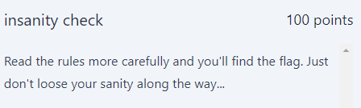

# Insanity-check

  

## FLAG:
`GPNCTF{K4rlsruh3r_VI4gg3n_V3rbund_Ch0o_ch0o}`

## Solution

this challenge provided only a description. The first thing i did was to carefully read the rule in the DIscord server but i couldn't find anything. The second thing I did was to go to the CTF site and explore the HTML code of the site. I noticed that a little yellow train was randomly passing by that caught my eye, and exploring its contents at this link  https://ctf.kitctf.de/themes/factory/static/img/a21ad35d6b99f12ebd9ae185fbc8d450.svg we can find the flag.