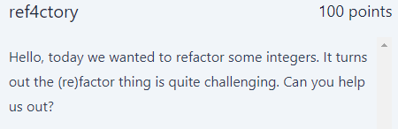

# Ref4ctory
<p align="center">
  
</p>

## FLAG:
`GPNCTF{Gaussian_Integers_n33d_Gaussian_Primes}`

## Solution

This challenge provided its source code written in python. The most important snippet of code of this challenge is this:

```python
def check_factors(a,b,ab):
    if abs(a)<=1 or abs(b)<=1:
        print("too easy")
        return False
    if type(a*b) == float:
        print("no floats please")
        return False
    return a*b == ab 


factors = [4,10,0x123120,38201373467,247867822373,422943922809193529087,3741]
```

this method ask to us that a multiplied b gives as the result the factor given in the list. What I did was to go to http://factordb.com/ and write down the factors one by one (except trivial ones, e.g., evens) to find 2 factors that I could multiply. My goal was to find a and b, and in the case where factordb returned more than 2 factors I reduced them to 2 by multiplying them with each other. There were no particular constraints on the values a and b except that a and b could not be equal to 1. My final script is the following which returns the flag.

```python
from pwn import *
p=process(['ncat','--ssl','ref4ctory-0.chals.kitctf.de','1337'])
f=['2*2', '2*5', '2*596112', '111871*341477', '268817*922069', '458843971*921759790997', '87*43']
p.recv()
for i in f:
 j=i.split("*")
 p.sendline(j[0].encode())
 p.sendline(j[1].encode())
 p.recv()

p.recv()
```

