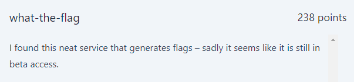
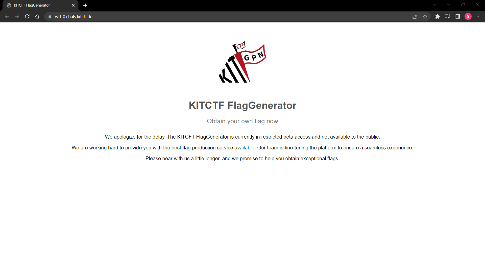
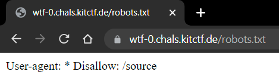
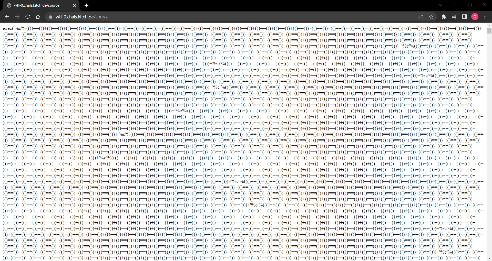
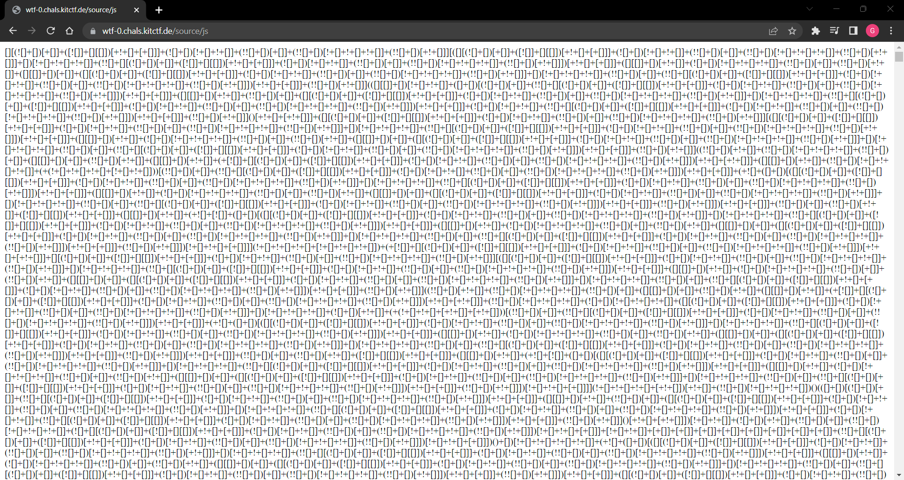

# what-the-flag
<p align="center">
  
</p>

## FLAG:
`GPNCTF{qSf1PSqRtUspio040GHg}`

## Solution
The challenge provides a [link to a website](https://wtf-0.chals.kitctf.de/) which (as the description reads) is in beta access.



Apparently nothing can be given, but visiting the `robots.txt` endpoint we discover the redirection to the source code.

<p align="center">
  
</p>

The page containing the [source code](Attachments/source) is obfuscated using the following pattern: "`(()==())+`"



In particular, it has been discovered that the number of times this pattern is repeated represents the decimal value of the corresponding character (ex: `(()==())+` repeated 95 times = '_').

That being said the following code was used to deobfuscate:

```python
f = open("source", "r").read().strip().split("'%c'%")[1:]

for char in f:
    print(chr(char.count("(()==())+")), end="")
```

The [result](Attachments/source_deof.py) obtained is the following:

```python
_A='backend.js'
from flask import Flask,send_file,request,redirect
import os,json,subprocess
app=Flask(__name__)
@app.route('/')
def index():return send_file('index.html')
@app.route('/logo.svg')
def logo():return send_file('logo.svg')
@app.route('/robots.txt')
def robots():return'User-agent: *\nDisallow: /source'
@app.route('/source')
def source():
	with open('app.py')as A:return A.read()
@app.route('/source/js')
def js_source():
	with open(_A)as A:return A.read()
@app.route('/3ng1n33r1ng-s4mpl3',methods=['POST'])
def flag():
	A = {A[0]:A[1]for A in request.headers.items()}
	B = request.args.to_dict()
	if subprocess.check_output(['node',_A,str(A),str(B),str(request.json)]).decode().strip()=='Valid':return os.environ.get('FLAG')
	return redirect('/')
if __name__=='__main__':app.run()
```

This shows the presence of further endpoints, in particular it denotes that the flag is returned only as a function of receiving some parameters which are compared with those contained in the file "*_A*" which can be read through the endpoint "`/source/js`". 

Visiting the page we find more [obfuscated code](Attachments/source-js), this time, through the use of the esoteric language [JSFuck](https://en.wikipedia.org/wiki/JSFuck).



Through the use of an online [decoder](https://js-fuck-and-hieroglyphy-decoder-and-encoder.vercel.app/) we obtain the [deobfuscated code](Attachments/source_js_deob.js):

```js
d = JSON.parse(`{"header_key": "[-]>[-]<++++++++[>++++++++++<-]>++++++++.<++++[>----------<-]>---.<++[>++++++++++<-]>++++.<++[>++++++++++<-]>++++++++.<+[>++++++++++<-]>+++++++.<[>----------<-]>------.<+[>++++++++++<-]>+++.<+++++++[>----------<-]>------.<++[>++++++++++<-]>.<+++[>++++++++++<-]>++++.<[>----------<-]>.<[>++++++++++<-]>++.<+[>++++++++++<-]>++++.<[>----------<-]>.<", "header_value": "[-]>[-]<++++++++++[>++++++++++<-]>+++++++.<[>----------<-]>--.<+[>++++++++++<-]>+.<+[>----------<-]>-------.<+[>++++++++++<-]>+++++++.<+[>----------<-]>----.<+++++[>----------<-]>-------.<+++++[>++++++++++<-]>++++.<[>++++++++++<-]>++.<+[>++++++++++<-]>+++.<[>++++++++++<-]>++.<+[>----------<-]>-.<[>----------<-]>---.<[>++++++++++<-]>+++.<[>----------<-]>----.<[>----------<-]>-.<+++++[>----------<-]>-----.<+++++++[>++++++++++<-]>+.<+[>----------<-]>-----.<+[>++++++++++<-]>++++.<[>++++++++++<-]>+.<+[>----------<-]>-----.<+[>++++++++++<-]>+++.<", "query_key": "[-]>[-]<++++++++++[>++++++++++<-]>+++++++.<[>----------<-]>------.<++[>++++++++++<-]>.<", "query_value": "[-]>[-]<+++++[>++++++++++<-]>+++.<[>----------<-]>-.<[>++++++++++<-]>++.<[>++++++++++<-]>++.<[>----------<-]>--.<[>++++++++++<-]>+++.<[>----------<-]>--.<[>----------<-]>----.<[>----------<-]>-.<[>----------<-]>--.<[>++++++++++<-]>++++++.<[>++++++++++<-]>+++.<[>----------<-]>--.<[>----------<-]>----.<[>----------<-]>-.<[>----------<-]>--.<[>++++++++++<-]>++++++.<[>----------<-]>-----.<[>++++++++++<-]>+.<[>----------<-]>--.<[>++++++++++<-]>+++++++.<[>----------<-]>-.<[>----------<-]>.<[>----------<-]>-----.<[>++++++++++<-]>+++++.<++++[>++++++++++<-]>+++++.<++++[>----------<-]>-----.<[>++++++++++<-]>+++.<[>----------<-]>---.<[>----------<-]>--.<[>----------<-]>--.<[>----------<-]>--.<[>++++++++++<-]>++++++.<++++[>++++++++++<-]>++++.<++++[>----------<-]>----.<[>----------<-]>-.<[>++++++++++<-]>++.<[>++++++++++<-]>++.<", "body_key": "[-]>[-]<+++++++++++[>++++++++++<-]>++++.<+[>----------<-]>---.<+[>++++++++++<-]>++++.<[>----------<-]>----.<[>++++++++++<-]>++++++.<[>----------<-]>---.<+[>----------<-]>-----.<[>++++++++++<-]>++.<", "body_value": "[-]>[-]<++++++++++[>++++++++++<-]>++.<[>++++++++++<-]>++++++.<+[>----------<-]>-.<[>++++++++++<-]>++++++.<", "cookie_key": "[-]>[-]<+++++++++++[>++++++++++<-]>.<+[>----------<-]>.<[>----------<-]>---.<", "cookie_value": "[-]>[-]<+++++++++++[>++++++++++<-]>++++++.<[>----------<-]>--.<[>++++++++++<-]>+++.<+[>----------<-]>------.<"}`);

function interpret(e) {
    let r = "",
        a = new Array(420).fill(0),
        s = 0,
        t = 0,
        o = "",
        i = !1;
    var c = [];
    braces = {}, e = e.replace(/[^<>+-.,\[\]]/, "");
    for (let r = 0; r < e.length; r++) "[" === e[r] && c.push(r), "]" === e[r] && (start = c.pop(), braces[start] = r, braces[r] = start);
    for (; !i;) {
        switch (e[s]) {
            case ">":
                t++;
                break;
            case "<":
                t--;
                break;
            case "-":
                a[t]--;
                break;
            case "+":
                a[t]++;
                break;
            case ".":
                o += String.fromCharCode(a[t]);
                break;
            case ",":
                a[t] = r.charCodeAt(0), r = r.substring(1);
                break;
            case "[":
                0 === a[t] && (s = braces[s]);
                break;
            case "]":
                0 !== a[t] && (s = braces[s]);
                break;
            case void 0:
                i = !0
        }
        s++
    }
    return o
}
const headers = JSON.parse(process.argv[2].split("'").join('"')),
    args = JSON.parse(process.argv[3].split("'").join('"')),
    body = JSON.parse(process.argv[4].split("'").join('"'));

headers[interpret(d.header_key)] === interpret(d.header_value) && args[interpret(d.query_key)] === interpret(d.query_value) && body[interpret(d.body_key)] === interpret(d.body_value) && headers.Cookie.split("=")[0] === interpret(d.cookie_key) && headers.Cookie.split("=")[1] === interpret(d.cookie_value) ? console.log("Valid") : console.log("Fake");;
```

From the above code we obtain the parameters that must be used to obtain the flag. These parameters are encoded through the use of the language [Brainfuck](https://en.wikipedia.org/wiki/Brainfuck).

Finally, to get the flag, a python script was written that uses the [requests](https://pypi.org/project/requests/) module to make the POST request to the endpoint "`/3ng1n33r1ng-s4mpl3`" and the [brainfuck-interpreter](https://pypi.org/project/brainfuck-interpreter/) module to deobfuscate parameters.

```python
from requests import post
from brainfuck import evaluate

parameters = {
    "header_key": "[-]>[-]<++++++++[>++++++++++<-]>++++++++.<++++[>----------<-]>---.<++[>++++++++++<-]>++++.<++[>++++++++++<-]>++++++++.<+[>++++++++++<-]>+++++++.<[>----------<-]>------.<+[>++++++++++<-]>+++.<+++++++[>----------<-]>------.<++[>++++++++++<-]>.<+++[>++++++++++<-]>++++.<[>----------<-]>.<[>++++++++++<-]>++.<+[>++++++++++<-]>++++.<[>----------<-]>.<",
    "header_value": "[-]>[-]<++++++++++[>++++++++++<-]>+++++++.<[>----------<-]>--.<+[>++++++++++<-]>+.<+[>----------<-]>-------.<+[>++++++++++<-]>+++++++.<+[>----------<-]>----.<+++++[>----------<-]>-------.<+++++[>++++++++++<-]>++++.<[>++++++++++<-]>++.<+[>++++++++++<-]>+++.<[>++++++++++<-]>++.<+[>----------<-]>-.<[>----------<-]>---.<[>++++++++++<-]>+++.<[>----------<-]>----.<[>----------<-]>-.<+++++[>----------<-]>-----.<+++++++[>++++++++++<-]>+.<+[>----------<-]>-----.<+[>++++++++++<-]>++++.<[>++++++++++<-]>+.<+[>----------<-]>-----.<+[>++++++++++<-]>+++.<",
    "query_key": "[-]>[-]<++++++++++[>++++++++++<-]>+++++++.<[>----------<-]>------.<++[>++++++++++<-]>.<",
    "query_value": "[-]>[-]<+++++[>++++++++++<-]>+++.<[>----------<-]>-.<[>++++++++++<-]>++.<[>++++++++++<-]>++.<[>----------<-]>--.<[>++++++++++<-]>+++.<[>----------<-]>--.<[>----------<-]>----.<[>----------<-]>-.<[>----------<-]>--.<[>++++++++++<-]>++++++.<[>++++++++++<-]>+++.<[>----------<-]>--.<[>----------<-]>----.<[>----------<-]>-.<[>----------<-]>--.<[>++++++++++<-]>++++++.<[>----------<-]>-----.<[>++++++++++<-]>+.<[>----------<-]>--.<[>++++++++++<-]>+++++++.<[>----------<-]>-.<[>----------<-]>.<[>----------<-]>-----.<[>++++++++++<-]>+++++.<++++[>++++++++++<-]>+++++.<++++[>----------<-]>-----.<[>++++++++++<-]>+++.<[>----------<-]>---.<[>----------<-]>--.<[>----------<-]>--.<[>----------<-]>--.<[>++++++++++<-]>++++++.<++++[>++++++++++<-]>++++.<++++[>----------<-]>----.<[>----------<-]>-.<[>++++++++++<-]>++.<[>++++++++++<-]>++.<",
    "body_key": "[-]>[-]<+++++++++++[>++++++++++<-]>++++.<+[>----------<-]>---.<+[>++++++++++<-]>++++.<[>----------<-]>----.<[>++++++++++<-]>++++++.<[>----------<-]>---.<+[>----------<-]>-----.<[>++++++++++<-]>++.<",
    "body_value": "[-]>[-]<++++++++++[>++++++++++<-]>++.<[>++++++++++<-]>++++++.<+[>----------<-]>-.<[>++++++++++<-]>++++++.<",
    "cookie_key": "[-]>[-]<+++++++++++[>++++++++++<-]>.<+[>----------<-]>.<[>----------<-]>---.<",
    "cookie_value": "[-]>[-]<+++++++++++[>++++++++++<-]>++++++.<[>----------<-]>--.<[>++++++++++<-]>+++.<+[>----------<-]>------.<"
    }

url = "https://wtf-0.chals.kitctf.de/3ng1n33r1ng-s4mpl3"

headers = {evaluate(parameters["header_key"]): evaluate(parameters["header_value"])}
params = {evaluate(parameters["query_key"]): evaluate(parameters["query_value"])}
cookies = {evaluate(parameters["cookie_key"]): evaluate(parameters["cookie_value"])}
body = {evaluate(parameters["body_key"]): evaluate(parameters["body_value"])}

r = post(url, headers=headers, params=params, cookies=cookies, json=body)
print("FLAG: " + r.text)
```