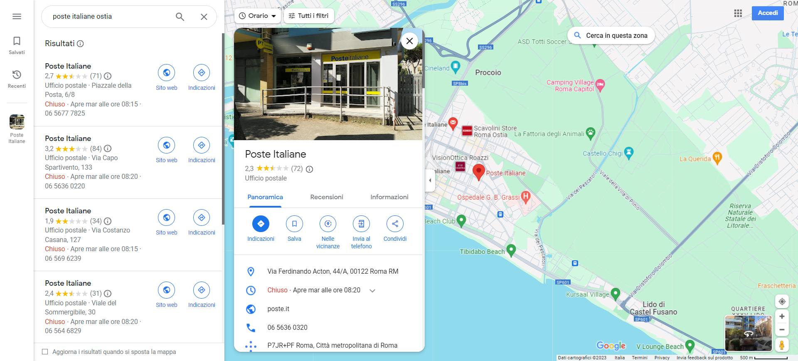

# Italian mails(Origins)
## DESCRIPTION: 
`Enzo Tommasi was a YouTube ""superstar"" in Italy. He went viral with this video initially and then with many others. Can you find out where he was in this epic clip?`

[Video](https://www.youtube.com/watch?v=rNta7FLxq8s&ab_channel=Team_demon_loba)

`Flag format: hctf{street_name_number}`

### Author: 
`@unleashed`

## FLAG:
`hctf{Via_Ferdinando_Acton_44}`

## Solution
In the [video](https://www.youtube.com/watch?v=rNta7FLxq8s&ab_channel=Team_demon_loba) we see that Enzo comes out of a post office, so knowing that he is from Ostia, just look for the post offices to get the flag.

  

