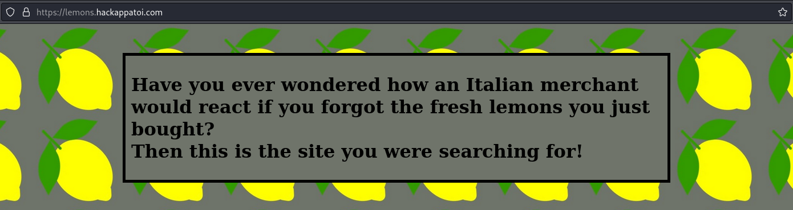
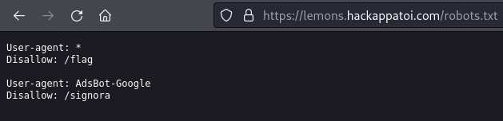
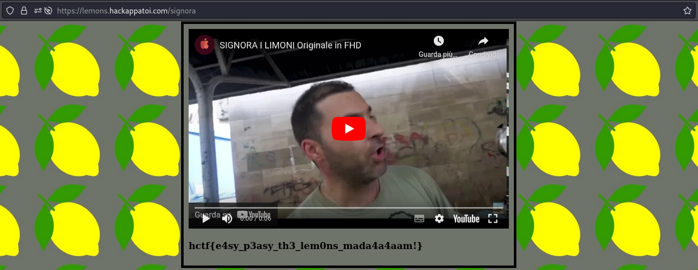

# Lemons
## DESCRIPTION: 
`Perhaps not everyone knows that Italy produces top-quality lemons. No wonder that forgetting them at the counter is a very serious matter...`

https://lemons.hackappatoi.com

### Author: 
`@voidptr`

## FLAG:
`hctf{e4sy_p3asy_th3_lem0ns_mada4a4aam!}`

## Solution
What we see as soon as we visit the [challenge link](https://lemons.hackappatoi.com) is a simple, apparently empty website.

  

But by searching `robots.txt` we find what we are interested in.

  

The `/flag` endpoint is a Rickrolling so we visit the second endpoint and we have the flag.

  

