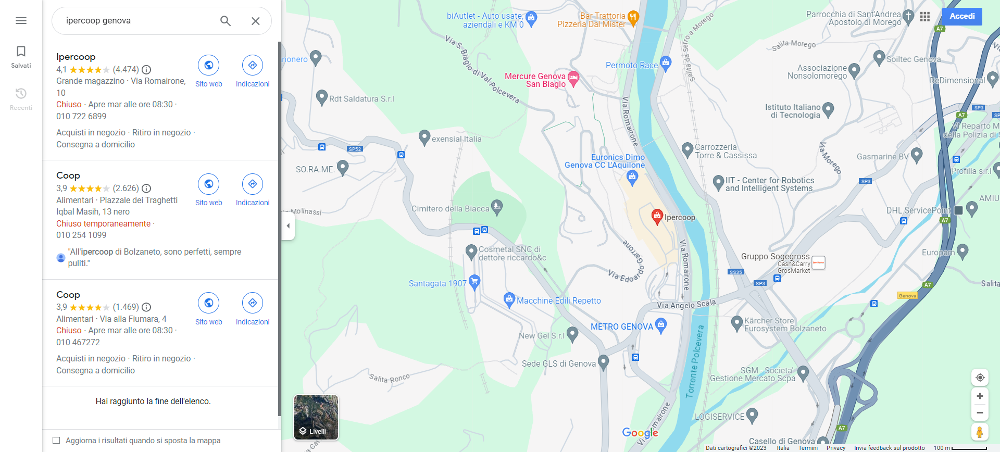
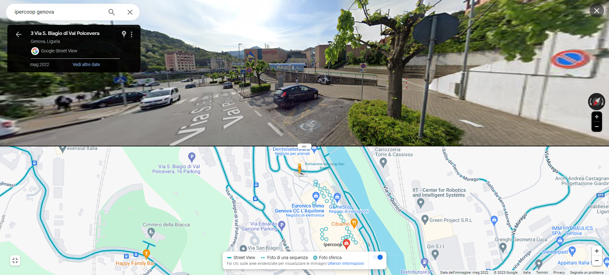

# Telecamere
## DESCRIPTION: 
`Roberto seems a bit tired of the interview. Could you locate him and offer some assistance?`

[interview](https://www.youtube.com/watch?v=Hs87MAgXO1k&ab_channel=SnapTvshow)

`(The flag is the street in front of Roberto)`

`Flag Format: hctf{street_address_city}, does not include C.A.P. or other numbers`

### Author: 
`@unleashed`

## FLAG:
`hctf{Via_San_Biagio_di_Val_Polcevera_Genova}`

## Solution
In the video we see the sign of a hypercoop and this information combined with the fact that they are originally from Genoa, allows us to search for the place on Google Maps.

  

Based on what is written in the description, we position ourselves on the street in front of where the video was shot to get the flag.

  

