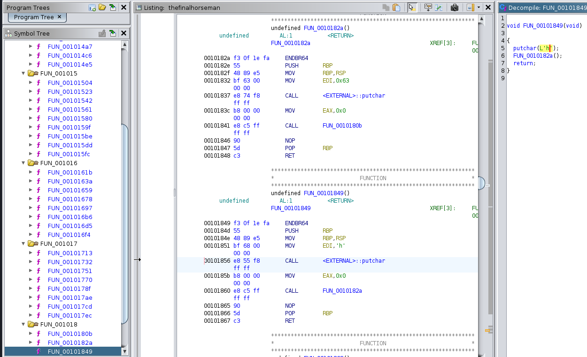

# The final horseman
## DESCRIPTION: 
`You have reached the place that the third horseman has suggested. Are you ready for the last step? The destiny of the world is on your shoulders.`

[thefinalhorseman](Attachments/thefinalhorseman)

### Author: 
`@retro4hack`

## FLAG:
`hctf{https://youtu.be/vXejrAXXmkU}`

## Solution
After downloading the [file](Attachments/thefinalhorseman) and decompiling (using [Ghidra](https://ghidra-sre.org/)), let's analyze the `main` (`FUN_00101868` because the binary is stripped).

```c
undefined8 FUN_00101868(void)

{
  long lVar1;
  long in_FS_OFFSET;
  
  lVar1 = *(long *)(in_FS_OFFSET + 0x28);
  puts(
      "You\'re finally reaching the end. This is the final step and you already know who is the last  horseman."
      );
  puts(
      "You\'re now on the top of this apparently infinite spiral staircase, and you find yourself in  front of a glass door."
      );
  puts("You enter the room, and you immediately hear a loud voice:");
  puts("\'Cribio you are finally here. But you know, a comunista like you cannot stop my plan.\'");
  puts("\nThe room is a giant mirror maze. You have to find your way to the Cavaliere.\n");
  puts(
      "You are too scared to proceed. You decide to go back, and the Cavaliere finally destroys the world."
      );
  if (lVar1 == *(long *)(in_FS_OFFSET + 0x28)) {
    return 1;
  }
                    /* WARNING: Subroutine does not return */
  __stack_chk_fail();
}
```

The main does not contain anything interesting but there are multiple functions (see *Symbol Tree* in the figure below) and analyzing them we notice that each of them prints a character and calls a subsequent one so as to define a sequence of calls that will give us the flag ( since the first four functions parsed in succession, printed *hctf*).

<p align="center">
  
</p>

Then using the `jump` command offered by [GDB](https://www.gdbtutorial.com/tutorial/how-install-gdb) ([pwndbg](https://github.com/pwndbg/pwndbg ) is a GDB plugin), we can execute the function `FUN_00101849` and have the flag.

```
pwndbg> jump *(0x555555554000 + 0x1849)
Continuing at 0x555555555849.
hctf{https://youtu.be/vXejrAXXmkU}
You're finally reaching the end. This is the final step and you already know who is the last horseman.
You're now on the top of this apparently infinite spiral staircase, and you find yourself in front of a glass door.
You enter the room, and you immediately hear a loud voice:
'Cribio you are finally here. But you know, a comunista like you cannot stop my plan.'

The room is a giant mirror maze. You have to find your way to the Cavaliere.

You are too scared to proceed. You decide to go back, and the Cavaliere finally destroys the world.
```