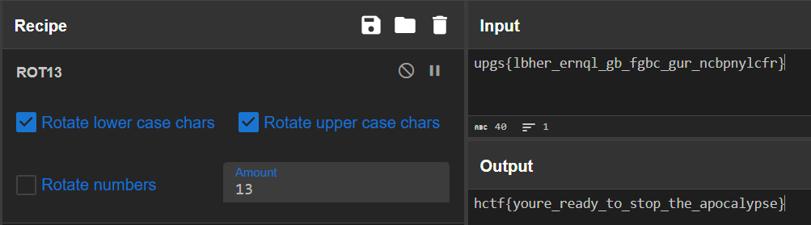

# The four horseman
## DESCRIPTION: 
```
The Cavaliere is returned. He is awake and he’s ready to unleash the apocalypse. Are you the chosen one?
Solving this challenge will give you the access to the war against the four horsemen. Be ready.
```

[thefourhorsemen](Attachments/thefourhorsemen)

### Author: 
`@retro4hack`

## FLAG:
`hctf{youre_ready_to_stop_the_apocalypse}`

## Solution
Very simple challenge, in fact by executing the `strings` command on the downloaded file, we notice the presence of a string which could probably be the flag on which some operation was carried out to make it unrecognizable.

```bash
└─$ strings thefourhorsemen   

[...SNIPPET...]

PTE1
u+UH
upgs{lbhH
er_ernqlH
_gb_fgbcH
_gur_ncbH
pnylcfr}H
Insert the password
The password is wrong, the laptop begins ticking and then you see a blinding flash.
That's the last thing you see.
GAME OVER.
You have successfully unlocked the mysterious laptop.
You open a file you find a key:
And next to the key you find the number %d.
You are walking home, and on the pathway you find an old laptop. With a sticky note on it. That's what you read:
12/06/2024
A year has passed. But now  he is awake. The greatest, the Cavaliere, the horseman. And he is ready to unleash the apocalypse.
You open that laptop and all you see is a prompt for a password. But you have NO WAY to know the password. On the other hand you are a great reverse engineer
:*3$"

[...SNIPPET...]
```

Then we use [CyberChef](https://gchq.github.io/CyberChef/#recipe=ROT13(true,true,false,13)&input=dXBnc3tsYmhlcl9lcm5xbF9nYl9mZ2JjX2d1cl9uY2JwbnlsY2ZyfQ) to decrypt the string `upgs{lbher_ernql_gb_fgbc_gur_ncbpnylcfr}` have the flag.

<p align="center">
  
</p>