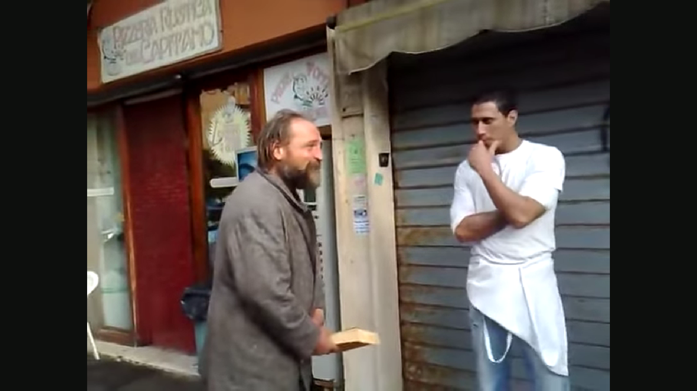
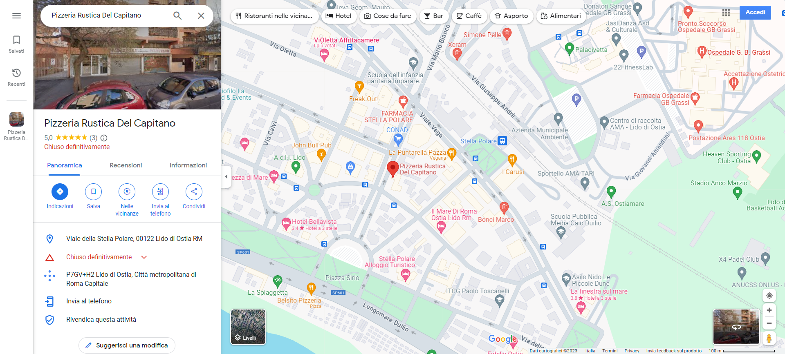

# The meninges
## DESCRIPTION: 
`In this video, our favorite character is arguing with his friend Vinicio and getting really angry. Can you find out where this clip was taken?`

[Video](https://www.youtube.com/watch?v=9tChJBadzuI&ab_channel=Sp4zz47ur4AnarchicaPasqualgruelica)

`Flag format: hctf{street_name}`

### Author: 
`@unleashed`

## FLAG:
`hctf{Viale_della_Stella_Polare}`

## Solution
Looking at the [video](https://www.youtube.com/watch?v=9tChJBadzuI&ab_channel=Sp4zz47ur4AnarchicaPasqualgruelica), we notice that the name of a pizzeria is shown at minute `3:02`.

  

We search for the name of the pizzeria on Google Maps and we have the flag.

  

