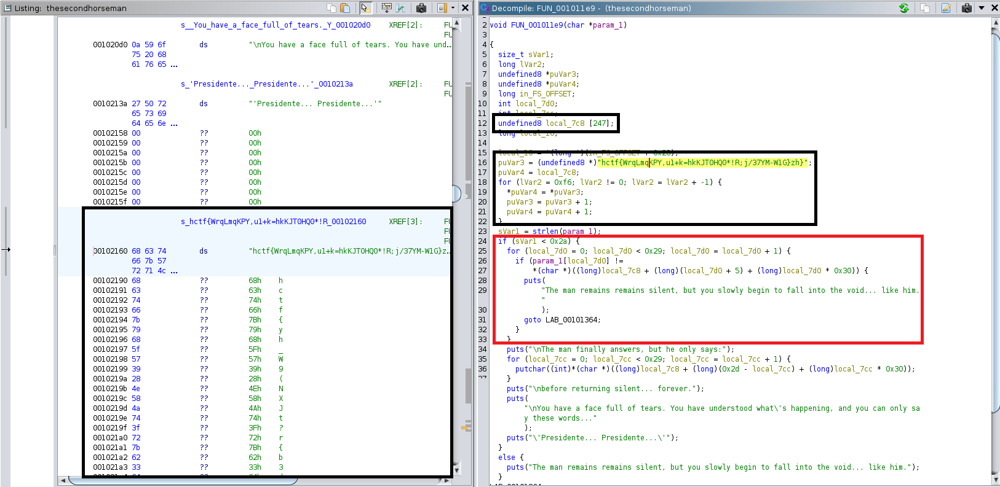

# The second horseman
## DESCRIPTION: 
`You reach a little room, but this time your enemy, the second horseman, will be… silent.`

[thesecondhorseman](Attachments/thesecondhorseman)

### Author: 
`@retro4hack`

## FLAG:
`hctf{www.youtube.com/watch?v=hnBuaJDNagU}`

## Solution
After downloading the [file](Attachments/thesecondhorseman) and decompiling (using [Ghidra](https://ghidra-sre.org/)), let's analyze the `main` (`FUN_0010137a` because the binary is stripped).

```c
undefined8 FUN_0010137a(void)

{
  long in_FS_OFFSET;
  undefined local_48 [56];
  long local_10;
  
  local_10 = *(long *)(in_FS_OFFSET + 0x28);
  puts(
      "And you are here, in the castle. You have defeated the first Horseman, but you know the Apoca lypse. There are still 3 horsemen to defeat."
      );
  puts(
      "While thinking about the next enemy, you reach the first floor. But what you find in front of  you is a little, screeching door:"
      );
  puts("it seems to have been closed for a long time");
  puts(
      "You enter in the room. It is small, empty, with just an armchair in the middle and an old man  looking lost."
      );
  puts(
      "You know it is him, your next enemy, but it seems so weak. You try to taunt him to get a reac tion, but he just stays silent."
      );
  puts("The lights turn on: You see a lot of writings on the wall.");
  puts("The key is there: and the man wants to know it.");
  printf("You say: ");
  __isoc99_scanf(&DAT_00102bba,local_48);
  FUN_001011e9(local_48);
  if (local_10 != *(long *)(in_FS_OFFSET + 0x28)) {
                    /* WARNING: Subroutine does not return */
    __stack_chk_fail();
  }
  return 0;
}
```

What you notice is that the input (`local_48`) is passed to the function named `FUN_001011e9`, so we analyze it.

<p align="center">
  
</p>

The key to solving the challenge lies in the boxed content. In particular, the black squares denote the creation of an array of 247 elements, starting from a series of strings contained in memory. This array is used to check the user's input (red square).
Based on the above, the following [script](Attachments/solve.py) has been implemented to resolve the challenge.

```python
from pwn import *

def sl(line): return r.sendline(line)
def sla(delim, line): return r.sendlineafter(delim,line)
def rcl(): return r.recvline()
def rcu(d1, d2=0):
	r.recvuntil(d1, drop=True)
	if (d2):
		return r.recvuntil(d2, drop=True)


binary = "./thesecondhorseman"

gdbscript="""
	break main
"""

r = process(binary)

if args.GDB:
	gdb.attach(r, gdbscript=gdbscript)

if args.DEBUG:
	context.log_level = 'debug'


BOX = b"hctf{WrqLmqKPY,u1+k=hkKJT0HQ0*!R;j/37YM-W1G}zh}hctf{yh_W9(NXJt?r{b3dQ8!RuuVE;3f,&bd+c?!#bqkcj}hctf{CYa?inn_C;$r1ZCjMm_TdNCcU{6AFFY8P3tTeYtZ]}hctf{wkhtbf*q3;b=EFL?F8=AL}hctf{k{WLB5x5pr*qp!6PuBSEekW(KKB,P!Py=;0.tg@*D}hctf{:c_5DV.(3CeTYVW0._2/hkmeefNGCvo0?L,Yf$*q{}hctf{*04dYH&Lx-6_D[xFRdWyj-:N[1w_)u(JEb_Q_{pii}hctf{A@!*U)5+5B8fdc3:A_{rJtmK,i39twF3a0Ek?)4yn}hctf{Xvw}TqTD-hw/FouVY4k:;6QmrSqu;_nuuH[iJDnn6}hctf{c/WJbng52E#@w#_RN@{#tE1_L@b9_RxHAYk@!1+MF}hctf{{/e*9}-5FRpDT3zyedjx_0v+yeL&)M#.S!3qV$vbw}hctf{YdwJ*p+0](_tY{y;o:GEtG_0.WTgS$gaMX!LxUn0t}hctf{Cjm+{vUR+,DKX)q}6ug!,=qc-qD_&mMbu]7t&8G4n}hctf{@A!ehh=zjz6a=kv,94_ByTo:1:8Y[#Qf#b4_n;ywx}hctf{L}Z5:A@[Kq}b?YzP={Gw4m:;f)WUM7wp(??9!M@-@}hctf{CZ+.w4MudHrNPSZkPN)(/3.=/XT)UhBK6[Hp1SG(V}hctf{VfXw@&T]q_v,p@yVSkKwKs{Lq}-W/5$LZ5NWUYX[H}hctf{ePiB=)=q-)B;f:W1n)a&Fbh;EZq)cDi)!/Pj.QBAT}hctf{rQg4/gQ=_)ppJ9r/Rt*)?6&_ESk0!}:}z1(ZnuW+4}hctf{]01J2?Jn_hkNuJ9cc4Y.$a0hf#HY3Xj#6&e5zpv5?}hctf{3v$CgfdS@_EmG!4hhxXLbG?YVo1S5&BWg(Dh[KGX(}hctf{JK3$9-d&w]3dD.?4em;n/hN-SernXwyKh2eXk3p.0}hctf{xJ;V}Sb@-8W@PvTdS&u8tw1W)4u_6nxgKKh_/Dw4w}hctf{0J/gv7Qr6*Rx=aXm.w#_7[-AL/B]o+!D)P-f;zx!M}hctf{@m_SHvUkvpChVwkqtrXP}+J}Cu8.1u}*7L-wPm&U#}hctf{6/{Q0TJ_L#n__nMRK]_xx]B1gPfjd4rKAvj!mtvJ?}hctf{1*#t}&yi4B*au,C*Gh}T$4dB;+5dedz_uNwZ:,{VB}hctf{-Z24em$!uJCw-4#7cf1(MDz,L=VGa7/!cfk-Xiwt?}hctf{)AP!d7uadtyMc*V+NhGK:4a[;(KMNmR_ThLY1[Um?}hctf{,t6!KVJ;8*4aP)+4/KL2dG0#$:_1&TFQ!]i7{Saf!}hctf{SAZF6D2MVfpHdgx}{7MPAr$EkN:*MLUH.XJlX{w+p}hctf{w?3LNn4+vnh{7GC$S9xA-@c9Ni;NiGD{[4;Wde(]G}hctf{aYkaKHe*h?twdCYy;&1CGZz{JY.7Z()mju)#qrS#t}hctf{,ygfJXkY_vwXY7$2CyJ2:WRWUb+*Qr(3FWN)PXet.}hctf{2U4G$+$6fCiu_Ny;Hqe*Brc:=QdKu#X$83]KMpqne}hctf{}i,7)CiyaHM6)Y-*gx;k}[(?@S=ehVS=t6!!c;mB?"

user_input = ""
for i in range(41):
	user_input += chr(BOX[(i + 5) + (i * 48) - i])
print(f"{user_input = }")

sla(b"it.\n", user_input.encode())
print(r.recv().decode().strip())
r.close()
```