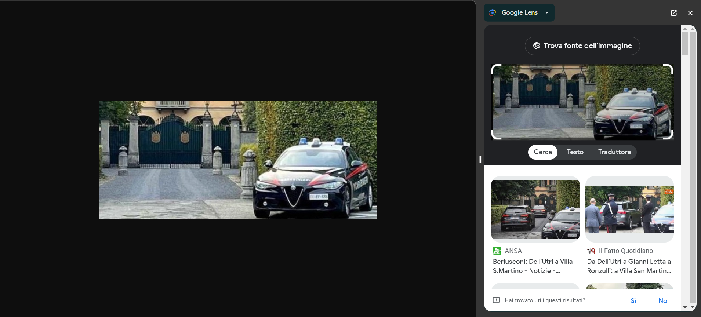

# The third horseman
## DESCRIPTION: 
```
You have solved the mistery for that old horseman, and you have the key to proceed. But this time, it is the third Horseman to stop you.
”I’ve always been a friend of the Cavaliere. But it is beyond the evil, and I cannot stand it anymore.”
And then he hands you a picture.
”I didn’t tell you anything. Quindi fatti li cazzi tua”.

Now you know where to find the final horseman.

Flag Format: hctf{Name_Of_The_Place}
```

[Third_horseman](Attachments/Third_horseman.png)

### Author: 
`@retro4hack`

## FLAG:
`hctf{Villa_San_Martino}`

## Solution
Very simple challenge, in fact all you had to do was search for the image with Google Lens to get the flag.

<p align="center">
  
</p>