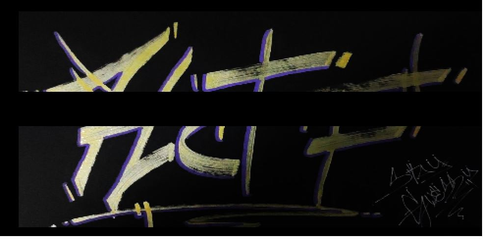

# Ghost Image

  

## FLAG:
`HCTF{M4MMaMIA_SO_M4NY_SHADOW8OXES_IN_TH1S_CSS}`

## Solution

the challenge is presented with a simple, very heavy web page that loads css styles. By playing with the source code downloaded on the local machine, I made the page render the hidden style part in time and by doing continuous zooms on the page the flag appears like this:

