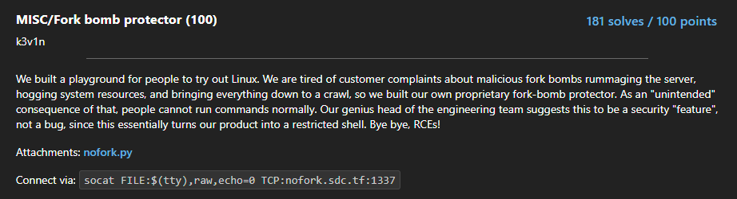

# Fork bomb protector
<p align="center">
  
</p>

## FLAG:
`sdctf{ju5T_3xEc_UR_w4y_0ut!}`
#
## Solution
The challenge is a simple jail challenge where all commands that `fork`, `vfork`, or `clone` are filtered out as can be seen in the provided [script](Attachments/nofork.py).

```python
#! /usr/bin/env python3
import os
from seccomp import SyscallFilter, ALLOW, ERRNO
from errno import EPERM

FORBID = ERRNO(EPERM)

# Ban all fork-related syscalls to prevent fork bombs
def init_seccomp():
    f = SyscallFilter(defaction=ALLOW)

    f.add_rule(FORBID, "fork")
    f.add_rule(FORBID, "vfork")
    f.add_rule(FORBID, "clone")

    f.load()

init_seccomp()
os.execvp('bash', ['bash'])
```

Connecting to the server, I saw that the flag was in the current directory

```bash
└─$ socat FILE:$(tty),raw,echo=0 TCP:nofork.sdc.tf:1337
== proof-of-work: disabled ==
bash: fork: Operation not permitted
user@NSJAIL:/home/user$ pwd
/home/user
user@NSJAIL:/home/user$ ls
bash: fork: Operation not permitted
user@NSJAIL:/home/user$ cd 
flag.txt       nofork.py      run-nsjail.sh 
``` 

So I looked for possible commands to run

```bash
user@NSJAIL:/home/user$ help
GNU bash, version 5.0.17(1)-release (x86_64-pc-linux-gnu)
These shell commands are defined internally.  Type `help' to see this list.
Type `help name' to find out more about the function `name'.
Use `info bash' to find out more about the shell in general.
Use `man -k' or `info' to find out more about commands not in this list.

A star (*) next to a name means that the command is disabled.

 job_spec [&]                            history [-c] [-d offset] [n] or hist>
 (( expression ))                        if COMMANDS; then COMMANDS; [ elif C>
 . filename [arguments]                  jobs [-lnprs] [jobspec ...] or jobs >
 :                                       kill [-s sigspec | -n signum | -sigs>
 [ arg... ]                              let arg [arg ...]
 [[ expression ]]                        local [option] name[=value] ...
 alias [-p] [name[=value] ... ]          logout [n]
 bg [job_spec ...]                       mapfile [-d delim] [-n count] [-O or>
 bind [-lpsvPSVX] [-m keymap] [-f file>  popd [-n] [+N | -N]
 break [n]                               printf [-v var] format [arguments]
 builtin [shell-builtin [arg ...]]       pushd [-n] [+N | -N | dir]
 caller [expr]                           pwd [-LP]
 case WORD in [PATTERN [| PATTERN]...)>  read [-ers] [-a array] [-d delim] [->
 cd [-L|[-P [-e]] [-@]] [dir]            readarray [-d delim] [-n count] [-O >
 command [-pVv] command [arg ...]        readonly [-aAf] [name[=value] ...] o>
 compgen [-abcdefgjksuv] [-o option] [>  return [n]
 complete [-abcdefgjksuv] [-pr] [-DEI]>  select NAME [in WORDS ... ;] do COMM>
 compopt [-o|+o option] [-DEI] [name .>  set [-abefhkmnptuvxBCHP] [-o option->
 continue [n]                            shift [n]
 coproc [NAME] command [redirections]    shopt [-pqsu] [-o] [optname ...]
 declare [-aAfFgilnrtux] [-p] [name[=v>  source filename [arguments]
 dirs [-clpv] [+N] [-N]                  suspend [-f]
 disown [-h] [-ar] [jobspec ... | pid >  test [expr]
 echo [-neE] [arg ...]                   time [-p] pipeline
 enable [-a] [-dnps] [-f filename] [na>  times
 eval [arg ...]                          trap [-lp] [[arg] signal_spec ...]
 exec [-cl] [-a name] [command [argume>  true
 exit [n]                                type [-afptP] name [name ...]
 export [-fn] [name[=value] ...] or ex>  typeset [-aAfFgilnrtux] [-p] name[=v>
 false                                   ulimit [-SHabcdefiklmnpqrstuvxPT] [l>
 fc [-e ename] [-lnr] [first] [last] o>  umask [-p] [-S] [mode]
 fg [job_spec]                           unalias [-a] name [name ...]
 for NAME [in WORDS ... ] ; do COMMAND>  unset [-f] [-v] [-n] [name ...]
 for (( exp1; exp2; exp3 )); do COMMAN>  until COMMANDS; do COMMANDS; done
 function name { COMMANDS ; } or name >  variables - Names and meanings of so>
 getopts optstring name [arg]            wait [-fn] [id ...]
 hash [-lr] [-p pathname] [-dt] [name >  while COMMANDS; do COMMANDS; done
 help [-dms] [pattern ...]               { COMMANDS ; }
```

You can run `exec`, so I printed the flag

```bash
user@NSJAIL:/home/user$ exec cat flag.txt
sdctf{ju5T_3xEc_UR_w4y_0ut!}
```