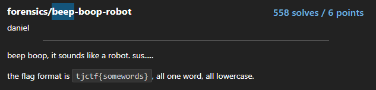

# Beep-boop-robot

  

## FLAG:
tjctf{thisisallonewordlmao}
## Solution

the challenge provides wav audio that emits a fairly familiar sound. Analyzing the waveforms with audacity I notice a pattern in the sound output similar to morse code. I put the wav on https://morsecode.world/international/decoder/audio-decoder-adaptive.html and it prints the flag (with a few incorrect characters but easily recognizable).
