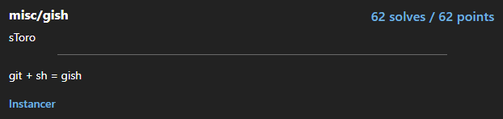

# Gish

  

## FLAG:
`tjctf{uncontrolled_versions_1831821a}`

## Solution

this challenge also provided its source code written in python. What it does is basically pass in input via subprocess the git commands we entered and ended with end. For each line of git entered the server parses them and if it thinks the line of code is valid it executes it. What I did in the [gish sequence of command](gishsolve) was: set up the top folder as a git repository, check the status of the operations performed by finding out the name of the flag file, add the configuration of a local account, do some commits, do some logging, and then finally check the differences between the various commits on the flag file.