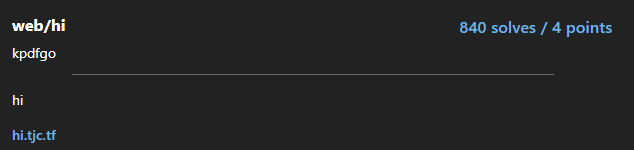

# Hi

  

## FLAG:
`tjctf{pretty_canvas_577f7045}`

## Solution
The challenge proposes a web page with a full-screen image. The first thing I did was read the source of the page in my browser's developer console and noticed this image https://hi.tjc.tf/secret-b888c3f2.svg that contained the flag.
