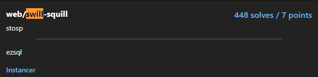

# Swill
<p align="center">
  
</p>

## FLAG:
`tjctf{swill_sql_1y1029345029374}`

## Solution
The challenge provides its source code written in the python language. As I carefully read through all the configuration files and files that implement web page routing, I notice this handling of account registration on the challenge site. The script is as follows:

```python
@app.route('/register', methods=['POST'])
def post_register():
    name = request.form['name']
    grade = request.form['grade']
    if name == 'admin':
    return make_response(redirect('/'))

res = make_response(redirect('/api'))
res.set_cookie("jwt_auth", generate_token(name))

c = conn.cursor()
c.execute("SELECT * FROM users WHERE name == '"+name+"';")

if c.fetchall():
    return res

c = conn.cursor()
c.execute('INSERT INTO users VALUES (?, ?)',
          (name, grade))
conn.commit()

return res
```
the name parameter is entered without any sanitization of the input, so it is obvious that a sql injection attack can be implemented very easily. Just enter a sql injection of the type 

```
user_random' or 1=1;-- -
```

 in the registration form and the flag is immediately obtained.