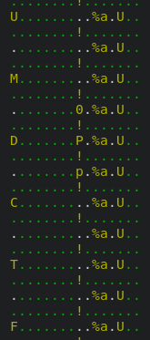

## Challenge Author:
`drkmrin78`
            
# Philip 1

## Description:

> Philip was working on a challenge when I took a snap of his vm. I found the flag, and I gonna be the only one to claim this flag since I scrubbed the flag from the raw image. MWAHAHA, more points for me >:)
>
> Note: the dwarf and system map are the same for all Phillip challenges
>
> https://drive.google.com/drive/folders/1c6vdBabGu33edSLXQZY5s8JAeM8au8Uo?usp=sharing

## Points: 
`433`

## Flag:
`UMDCTF-{G4ll4gh3r_4_1if3}`


# Challenge
We are given a .raw file which is a memory dump, a `module.dwarf` and `System.map-5.8.0-25-generic`.
Given the files, we immediately went to a trusted tool, [volatility](https://github.com/volatilityfoundation/volatility)
We need to create a profile for volatility in order to begin with our forensic analisys, to do so we must create a zip file containing `module.dwarf` and `System.map-5.8.0-25-generic` and move it in `volatility/plugins/overlays/linux/` after doing so we are ready to begin.
From now on assume that all the volatilty commands that are run are something like `python vol.py -f <image.raw> --profile=LinuxProfileName ...`
First thing that we did is run `linux_bash` and we get:

```
Pid      Name                 Command Time                   Command
-------- -------------------- ------------------------------ -------
    1534 bash                 2021-04-03 03:18:46 UTC+0000   clear
    1534 bash                 2021-04-03 03:19:19 UTC+0000   scp -i key -P 5001 ./super-secret-flag lubuntu@chals2.umdctf.io:~/
    1534 bash                 2021-04-14 22:11:37 UTC+0000   ssh -i key lubuntu@chals2.umdctf.io -p 5001
```

probably the target file is `super-secret-flag`, maybe there is still some trace of it, we can run `linux_enumarate_files` and grep on it to find something.
We find the file at inode address `0xffff95f1c313d7a0` so we can run `linux_find_file -i 0xffff95f1c313d7a0` in order to retrieve it, we get a base64 encoded string and if we decode it we get `{i_can_patch_ez_try_again}`, so this is not the flag, the next route we can try is looking for the ssh key file so we can connect to the remote machine and grab the real flag. The inode address of `key` is `0xffff95f1c3139f60` so we can run the same command again and get the key, with it we can connect to the remote server and grab the flag

# Philip 2

## Description

> Philip told me he found something to give him ctf flags for Dogecoin? I have to see for myself, but lets just take his!
>
> Note: the dwarf and system map are the same for all Phillip challenges
>
> https://drive.google.com/drive/folders/1r6BGYZsTpfS0pWuIu2fWPjAqalsae6kx?usp=sharing

## Points
`794`

## Flag
`UMDCTF-{M3g4_Ch4#g4$}`

# Challenge
This challenge follows the same concept as the first one, using `linux_psaux` we can see some processes, after skimming through some of them we find `thunderbird`, it's a mail application and it stores files on disk, we initially dumped the memory of the program and try to search for strings like `UMDCTF` but no flag, maybe we can recover the INBOX, so using `linux_enumerate_files` and grepping `INBOX` we find one named `INBOX` at inode address `0xffff95f1f02473c0`, if we get the file and import it in thunderbird we can look at the conversation and we see a zip file and after that the password for the zip, inside there is a pdf with the flag

# Philip 3

## Description

> Philip was starting to write a vault for flags? I don't know what that means, but he told me its going to be secure from my memory forensic antics. Total rubbish, lets show him who's l33t here!
>
> Note: the dwarf and system map are the same for all Phillip challenges
>
> https://drive.google.com/drive/folders/1dqAkBREWkguanZkek77r0UwHX1fp6GVL?usp=sharing

## Points
`928`

## Flag
`UMDCTF-{V0l$h311_isCool}`

# Challenge
Same as the last challenges, this time the description hints us that the flag might be inside a program made to store important stuff, running `linux_bash` gives us

```
Pid      Name                 Command Time                   Command
-------- -------------------- ------------------------------ -------
    1534 bash                 2021-04-03 02:35:31 UTC+0000   sudo apt update
    1534 bash                 2021-04-03 02:35:31 UTC+0000   ???5?Z
    1534 bash                 2021-04-03 02:36:48 UTC+0000   ???Z
    1534 bash                 2021-04-03 02:36:48 UTC+0000   sudo apt install make gcc
    1534 bash                 2021-04-04 20:48:42 UTC+0000   vim flag-vault.c
    1534 bash                 2021-04-04 20:49:32 UTC+0000   gcc flag-vault.c -o flag-vault
    1534 bash                 2021-04-04 20:49:32 UTC+0000
    1534 bash                 2021-04-04 20:49:39 UTC+0000   ./flag-vault
```

so the flag is probably inside `flag-vault`, we can retrieve the source code using the same commands as before.

```c++
#include <stdio.h>
#include <stdlib.h>

struct link {
    char c;
    struct link *next;
};

void add_link(char c, struct link *list) {
    struct link *curr = list;
    struct link *new_link = malloc(sizeof(struct link));

    new_link->c = c;
    new_link->next = 0;

    while (curr->next != 0) curr = curr->next;

    curr->next = new_link;
}

int main() {
    struct link head = {0};
    char c;

    while ((c = getc(stdin)) != EOF) {
        add_link(c, &head);
    }
}
```

the flag is inside a linked list, the links of the list are created with malloc, so the flag resides in the heap, we can retrieve the heap of the program by first finding the PID of the process with `linux_psaux` then using `linux_memmap` to dump the whole memory map of the process, then using `linnux_proc_maps` we can identify which one is the heap and we can inspect it with an hex editor, almost immediately we notice the beginning of the flag 



then copying the flag one char at a time (yeah I know, it's lame) we get the flag
