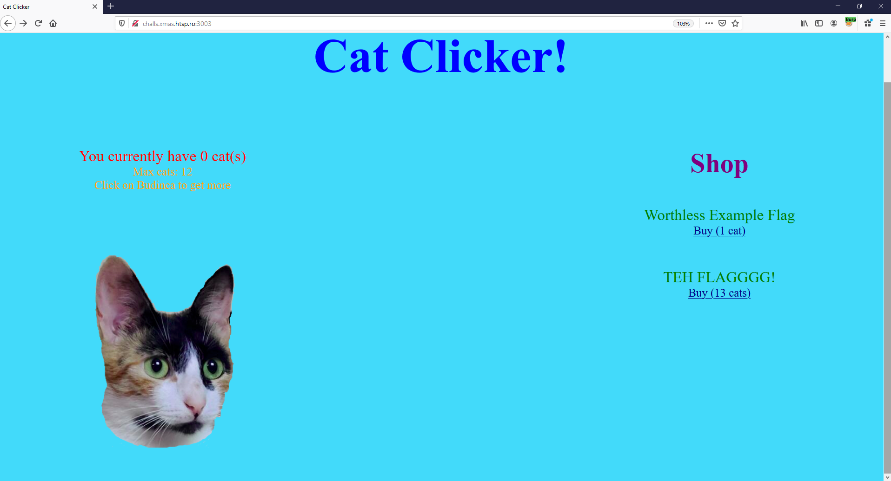
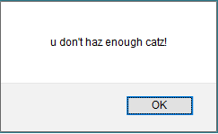

    	
            
# cat_clicker


## Challenge Author(s):
`yakuhito`

## Description:
```
Ever wanted to rescue cats in a game very similar to cookie clicker? If the answer is yes, then Cat Clicker is the perfect game for you!
```

## Target:

`http://challs.xmas.htsp.ro:3003/`

## Objective:

Get *13 cats* (limit is *12 cats*) bypassing the `hash (MD5) check` in order to "buy" the flag (flag cost is 13 cats).

## Difficulty/Points: 
`hard/474`

## Flag:
`X-MAS{1_h4v3_s0_m4ny_c4t5_th4t_my_h0m3_c4n_b3_c0ns1d3r3d_4_c4t_sh3lt3r_aaf30fcb4319effa}`
# 


# Challenge
The challenge allows you to get *cats* by clicking on the *"Budinca image"*, up to a maximum of 12 cats. Then these *cats* can be used to buy in the *shop*, both *Fake Flag (1 cat)*, and the *Real Flag (TEH FLAGGGG!) (13 cats)*.




When we try to buy something, inside the *HTTP POST request* sent to `/api/buy.php` , a *hash value* previously generated by the web application backend is inserted in it (read function `buy(item_id)` in *script.js*)... This hash value can be read by going to the browser's Javascript console and typing `window.token`. In addition to the hash value, a *state* *"12 | 0"* is also fixed , which represents *"<limit_cats> | <own_cats>*" (`window.state`).


# Solution
Ideally, the hash value is used as a *digital signature* to ensure integrity on the "*state*" set by the web application, so that no one can modify the content of "state", without invalidating the signature. In fact, the PHP code in the *buy.php* page will probably do an initial check to validate the signature of the current "*state*" that is extracted from the HTTP POST request, to verify that the attacker has not modified it, for example by entering "13 | 13". `This means that, most likely, the hash value is generated by concatenating the string of the "state" generating by web application with a secret value and everything is then passed in input to a hash function (ex. MD5, SHA-1 etc.).`

So the idea is to get the `secret value` and `the hash function used (probably MD5)`, in order to correctly sign the "state": "13 | 13" and get the flag. Surely to achieve this, it would be advisable to leak the source codes of the PHP pages involved, especially */api/buy.php*.
Fortunately, the *web server (nginx)* allows us to access the contents of the hidden `.git folder`("*The .git folder contains all the information that is necessary for your project in version control and all the information about commits, remote repository address, etc. All of them are present in this folder. It also contains a log that stores your commit history so that you can roll back to history.*").
Using a *Git Dumper* (https://github.com/internetwache/GitTools/tree/master/Dumper), you can download the contents of the entire *.git folder* locally:
```console
matt@grol:~$ ./gitdumper.sh http://challs.xmas.htsp.ro:3003/.git/ /root/XMAS2020/cat_clicker
###########
# GitDumper is part of https://github.com/internetwache/GitTools
#
# Developed and maintained by @gehaxelt from @internetwache
#
# Use at your own risk. Usage might be illegal in certain circumstances. 
# Only for educational purposes!
###########


[*] Destination folder does not exist
[+] Creating /root/XMAS2020/cat_clicker/.git/
[+] Downloaded: HEAD
[-] Downloaded: objects/info/packs
[+] Downloaded: description
[+] Downloaded: config
[+] Downloaded: COMMIT_EDITMSG
[+] Downloaded: index
[-] Downloaded: packed-refs
[+] Downloaded: refs/heads/master
[-] Downloaded: refs/remotes/origin/HEAD
[-] Downloaded: refs/stash
[+] Downloaded: logs/HEAD
[+] Downloaded: logs/refs/heads/master
[-] Downloaded: logs/refs/remotes/origin/HEAD
[-] Downloaded: info/refs
[+] Downloaded: info/exclude
[-] Downloaded: /refs/wip/index/refs/heads/master
[-] Downloaded: /refs/wip/wtree/refs/heads/master
[+] Downloaded: objects/60/0c2781d8b6ebde35aba651804b3aab89e87b45
[-] Downloaded: objects/00/00000000000000000000000000000000000000
[+] Downloaded: objects/19/96c117c1611297c70e468db79da3818272afe4
[+] Downloaded: objects/89/8ff69d8da0fa7c500eca4881e25065000d7972
[+] Downloaded: objects/52/06047e0d1027bd6f5e51d5631c663ac0de5a2d
[+] Downloaded: objects/94/d84d8cb2cc7f469749224e7200f6358bcb4a25
[+] Downloaded: objects/3b/289292b5410ed174dd270e9a370d97777a6911
[+] Downloaded: objects/8b/67bc52ab15147566c9b2b4ea5262c107d3b9a8
[+] Downloaded: objects/92/75ee80bbdc458c2e8c587a9d66ee54dfb11ad1
[+] Downloaded: objects/55/293a2bfc92e2e0edd4a80e8ba6e45933954243
[+] Downloaded: objects/c1/9c87f22d3228559c44c9ccbb451c799d50609d
[+] Downloaded: objects/f6/351bc7d2896f6f1cc6b15d4ae96dc8fbda80f0
```
Moving to the locally downloaded *.git folder*, we can use the classic *git commands*, such as `git show`:
```console
matt@grol:/root/XMAS2020/cat_clicker/.git$ git show
commit 600c2781d8b6ebde35aba651804b3aab89e87b45 (HEAD -> master)
Author: Peter Quinn <fake.email@example.com>
Date:   Fri Nov 27 12:31:12 2020 +0200

    first commit

diff --git a/api/buy.php b/api/buy.php
new file mode 100644
index 0000000..9275ee8
--- /dev/null
+++ b/api/buy.php
@@ -0,0 +1,43 @@
+<?php
+
+include('helper.php');
+
+$state = $_POST['state'];
+$hash = $_POST['hash'];
+$itemId = $_POST['item_id'];
+
+if(!isset($state) || !isset($hash) || !isset($itemId) || !verifyState($state, $hash, true) || ($itemId !== "1" && $itemId !== "2")) {
+       echo json_encode(array('success' => false));
+       die();
+}
+
+$cats = getCatsNo($state);
+$item = "";
+$ok = true;
+
+if($itemId === "1") {
+       if($cats >= 1) {
+               $cats -= 1;
+               $item = "FAKE-X-MAS{fake-flag-dont-submit-signed-yakuhito}";
+       } else {
+               $ok = false;
+       }
+} else {
+       if($cats >= 13) {
+               $cats = 1337;
+               $item = getenv("FLAG");
+       } else {
+               $ok = false;
+       }
+}
+$parentsLimit = getParentsLimit($state);
+$newState = "$parentsLimit | $cats";
+$newHash = hashFor($newState);
...
```
Thanks to this command, we are able to obtain the different sources of the *PHP pages*, grouped in this *.rar file*:

<a href="cat_clicker.zip" download>Click to Download</a>

